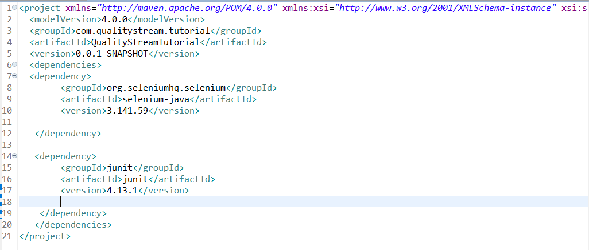
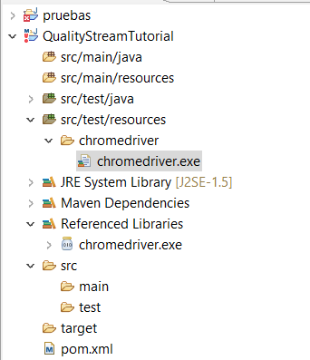
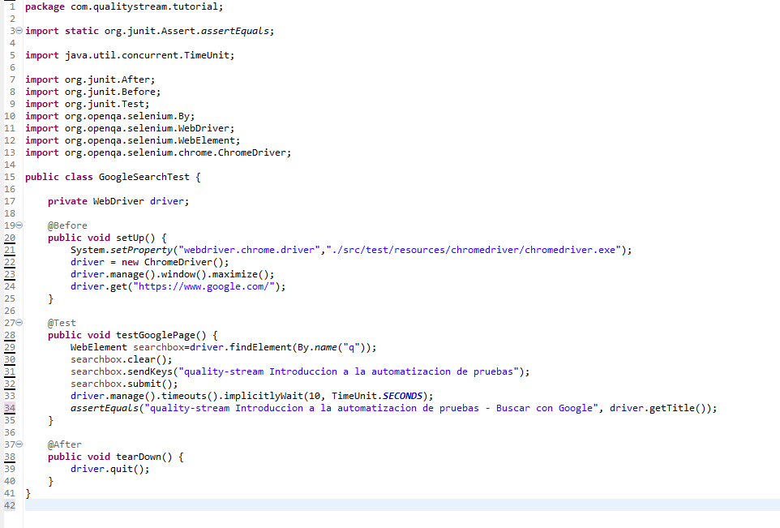

## Pruebas con selenium
Se realizaron las pruebas funcionales con selenium webdriver, para ello se usó el IDE eclipse, mediante el cual se procedió a instalar las librerías propias de selenium, a través de un archivo pom.xml, para llevar a cabo esta acción se copiaron las dependencias tanto de selenium así como de JUnit, para poder realizar las pruebas funcionales.

Posteriormente se procedió a implementar un script pequeño para probar el uso de selenium junto con chromedriver, debido a que el navegaodor web que tengo por defecto es chrome, para ello pasamos a copiar dentro del proyecto el archivo ejecutable de chromedriver:

El script desarrollado trata básicamente de crear un objeto de tipo WebDriver, el cual nos va a permitir abrir el navegador google chrome de nuestro equipo, una vez allí ingresa a la url: www:google.com , posteriormente se realiza una búsqueda determinada en el navegador, el cual se realiza de forma automática, y una vez terminada la búsqueda se porcede a cerrar el navegador, en la imagen inferior podemos apreciar el script creado:

